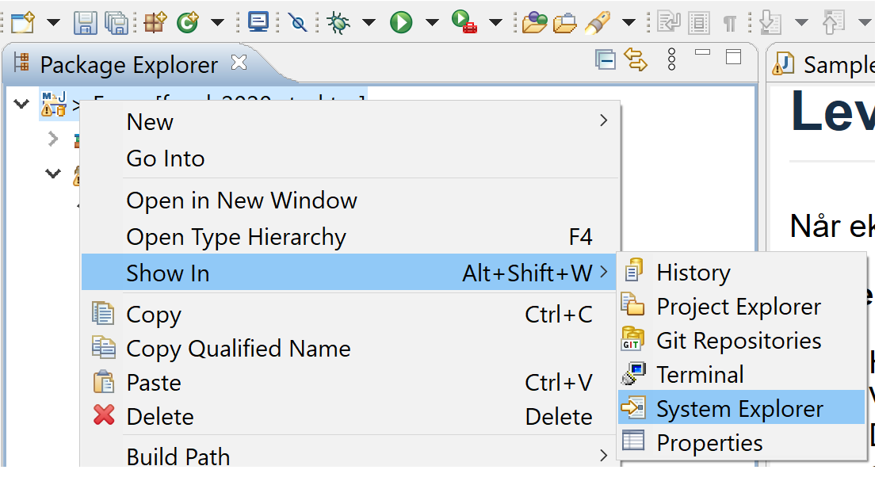

# Exam Spring 2021

The task consists of the following parts, which are inside separate packages. (Some parts have the same package as they use the same classes)

- [Part 1](src/main/java/del1/del1_en.md): VaccineTrial and VaccineTrialVolunteer (15%)
- [Part 2](src/main/java/del2/del2_en.md): Encapsulation and object structures (5%)
- [Part 3](src/main/java/del3/del3_en.md): Delegation (10%)
- [Part 4](src/main/java/del4/del4_en.md): Interfaces and Comparators (15%)
- [Part 5](src/main/java/del5_og_6/del5_og_6_en.md): Observer-Observed (20%)
- [Part 6](src/main/java/del5_og_6/del5_og_6_en.md): Inheritance and Debugging (10%)
- [Part 7](src/main/java/del7_og_8/del7_og_8_en.md): File management (15%)
- [Part 8](src/main/java/del7_og_8/del7_og_8_en.md): Functional interfaces and lists (10%)

Ignore the testeksamen package. (It is not deleted to avoid conflict, feel free to remove it if you feel it is disturbing you) 

## Exam format

Task descriptions can be found under each package. That is src/main/java/del1/del1_en.md contains the task description for part 1. The tasks have a text description, but this is not always complete. The most comprehensive requirements for a method are in its javadoc description, ie a comment that precedes the method itself in the source code. Basically, you can use the .md files to navigate to the right classes that are actually to be implemented, all of the requirements for methods are in the Java doc itself. It is nevertheless specified in many tasks which methods are to be implemented and what these are to do, but this is also stated in the Java-doc, and only the Java-doc contains information about eg Exceptions to be triggered. If you think there's differences in the task description and the Java-doc, consider the java-docs the source of truth. 

A web-page view of the Java-doc can be seen by opening the docs/index.html file in the project. 

If you are not be able to implement a method in a part, you can of course continue to use it as if it worked (as in previous 'paper exams'). The method should still compile, but all skeleton code provided by us will compile initially. 

All classes considered for grading must compile. This means that you should not have any "unresolved compilation problem" errors or red lines in Eclipse for a given class.
Exceptions in the code such as NullPointerException are not compilation problems (but will of course not get the full score). You should test your own code so that you know it is running. To help with this, most parts have main method that contains some code to test the implementation. These main methods do not necessarily test all cases so you're encouraged to extend it with your own testing. This testing should compile but otherwise there's no need to remove it before delivery. 

## Navigation

Task descriptions can be used to help navigate to the correct files. Once you have opened a .md file, you can press the **Preview** tab in Eclipse to make it more readable.

All the methods you have to fill in are marked with // TODO. You can get up all //TODOs this is by opening the **Tasks** view in Eclipse. This can be found at **Window> Show View> Other** and search for * tasks *.

## Answer

* The thesis text * can be found in ** del1.md ** files and other md files in the project and can be read both on gitlab and in the IDE. Versions in Nynorsk and English can be found in separate files. The Eclipse editor for md files has a ** Preview ** tab that makes it easy to read and navigate.

The task *is answered* by building on the code files that are there, and in any comments on the code, e.g. assumptions you make, in a separate md file (oppgavekommentarer.md)

## Download and import

  Download* and *import* is done either by downloading a zip file from the repo page on gitlab or Inspera, or by cloning the git repo. The same zip file is also an element here on Bb.

For *import of zip file*, the wizard **Import> Maven> Existing Maven Projects** should be used. Navigate to the downloaded zip file (remember to open the zip file first) and select the folder that contains the pom.xml file. When importing a zip file, you should also change the name of the project if you download it in advance, so that you do not have a conflict with naming when you download the exam itself.

* Import with cloning * takes place with another wizard, as described on the following wiki page: <https://www.ntnu.no/wiki/display/tdt4100/Importe+kode+fra+git>.

If there are conflicts when you pull, you can right-click and * Replace with> Head Revision * on the project.

## Delivery
When you are ready to deliver your exam, your project folder needs to be zipped and uploaded to Inspera. You can prepare the zip file like this:

**Zipping in Windows**
- Right-click the project icon in the leftmost 'Package Explorer' window in Eclipse.
- Choose 'Show in' -> click 'System Explorer'.
- You should now have a System Explorer window (not in Eclipse) open in a folder that most likely ends with 'git', for me it is 'C:\Users\borgeha\git'. The folder we want to compress is the project folder inside this git folder.
- Right click the project folder exam2021 -> Send to  -> Compressed (zipped) folder.
- Windows now compresses this folder into the git folder, and asks you to name it. Leave it as it is.
- This zip file is the one you shall upload to Inspera.
- You'll find a couple of screen shots of the process below.

**Zipping in OS X**
- Follow the same guideline as for Windows above, but instead chose to open in 'Finder'.
- Inside the Finder, right click exam2021 and choose 'Compress'
- The resulting file is the one you upload to Inspera.

**System Explorer**

**Compress**

