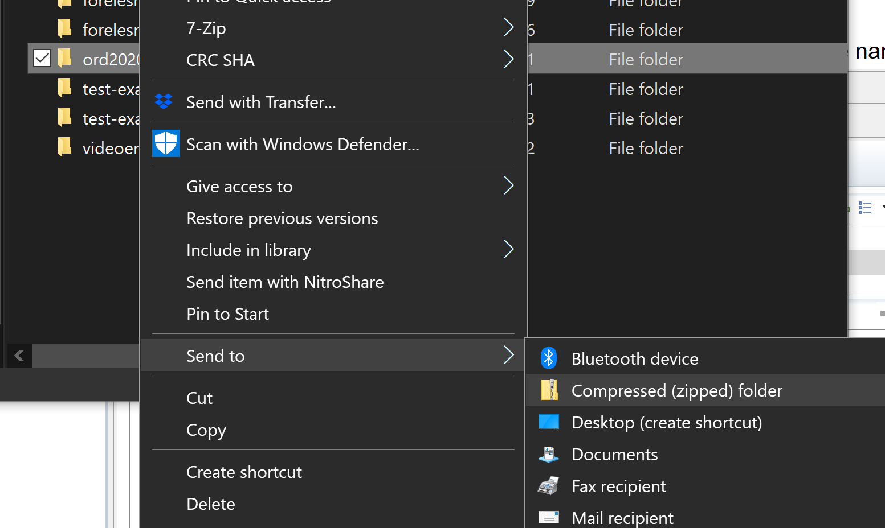

# Eksamen Vår 2021

Oppgåva består av følgjande delar, som ligg inne i kvar sin pakke. (Nokon delar har same pakke då dei nyttar seg av same klassar) 

- [Del 1](src/main/java/del1/del1_nn.md): VaccineTrial og VaccineTrialVolunteer (15 %)
- [Del 2](src/main/java/del2/del2_nn.md): Innkapsling og objektstrukturar (5 %)
- [Del 3](src/main/java/del3/del3_nn.md): Delegering (10 %)
- [Del 4](src/main/java/del4/del4_nn.md): Interfaces og Comparators (15 %)
- [Del 5](src/main/java/del5_og_6/del5_og_6_nn.md): Observatør-Observert (20 %)
- [Del 6](src/main/java/del5_og_6/del5_og_6_nn.md): Arv og Debugging (10 %)
- [Del 7](src/main/java/del7_og_8/del7_og_8_nn.md): Filhåndtering (15 %)
- [Del 8](src/main/java/del7_og_8/del7_og_8_nn.md): Funksjonelle grensesnitt og lister (10 %)

Ignorerer testeksamen pakken, (han er ikkje fjerna for å unngå konfliktar, og kan slettes av dykk viss den kjennest i vegen).

## Oppgåve format

Oppgavebeskrivelsene finn de under kvar del. Det vil seia src/main/java/del1/del1.md inneheld oppgåveskildringa for del 1. Oppgåvene har ei tekstskildring, men denne er ikkje alltid utfyllande. Dei mest utfyllande krava til ein metode står i dens javadoc-beskrivelse, altså ein kommentar som står før metoden sjølv i kjeldekoden. I utgangspunktet treng de kunne å bruka .md-filene for å navigera til riktige klassar som faktisk skal implementerast, alt av krav til metodar står i sjølve Java-docen. Det er likevel i mange oppgåver spesifiserte kva metodar som skal implementerast, og kva desse skal gjera, men dette står då og i Java-docen, og berre Java-docen inneheld informasjon om f.eks Exceptions som skal utløysast. Dersom du meiner at Java-docs og oppgåveskildring inneheld motstridande informasjon, ta først og fremst omsyn til det som står i Java-docen.  

Eit web-view av Java-docen kan og bli sett av å apne doc/index.html fila i prosjektet. 

Viss du ikkje skulle klara å implementera ein metode i ein del kan du sjølvsagt bruka denne vidare som om han verka (som i tidlegare 'papireksamenar'). Merk at metoden bør framleis kompilera, alle metodar kompilerer ved hjelp av *dummy* return verdiar. 

Alle klassar som blir for vurderte karakterering må kompilera. Dette betyr at du ikkje skal ha nokon "unresolved compilation problem" -feil eller raude linjer i Eclipse for ein gitt klasse. 
Unntak i koden som NullPointerException er ikkje kompileringsproblemer (men vil sjølvsagt ikkje få full poengsum). De bør testa dykkar eigen kode slik at de veit at denne køyrer. For å hjelpa med dette har dei fleste delar main-metode som inneheld noko kode for å testa implementeringen. Desse main-metodene testar ikkje nødvendigvis alle tilfelle så du blir oppfordra til å utvida med dine eigne metodar. Denne koden bør framleis kompilera, men treng ikkje fjernast ved levering.

## Navigering

Oppgave skildringane kan brukast som hjelp til å navigera til riktige filer. Når du har ope ein .md-fil kan du trykka på **Preview*-fana i Eclipse for å få dette på ein meir leselig måta. 

Alle metodane de skal fylla inn er og markerte med //TODO. Du kan få opp alle stader der dette står med å apne **Tasks*-viewet i Eclipse. Dette finn du ved **Window > Show View > Other** og søka på *tasks*. 

## Besvarelse

Oppgaveteksten finst i  **del1.md*-filer og andre md-filer i prosjektet og kan lesast både på gitlab og i IDE-en. Versjonar på nynorsk og engelsk finst i eigne filer. Eclipse-editoren for md-filer har ein  **Preview*-fane som gjer det lett å lesa og navigera.

Oppgåva  blir svart på* ved å bygga vidare på kode-filene som er der, og fylla evt. antakelser du gjer, i ein separat md-fil (oppgavekommentarer.md)

## Nedlasting og import

Nedlasting og  import* skjer enten ved å lasta ned ein zip-fil frå repo-sida på gitlab eller Inspera, eller ved å klona git-repoet. Same zip-fil ligg òg som element her på Bb. 

Ved  import av zip-fil*, så skal vegvisaren  *Import > Maven > Existing Maven Projects** brukast. Naviger til den nedlastede zip-filen (hugs og opne zip-filen først) og vel mappa som gjer at pom.xml fila ligg inne i denne. Ved import av zip-fil bør du og byta namn på prosjektet viss du lastar det ned på førehand, så du ikkje får konflikt med navngivning når du skal lasta ned sjølve eksamen. 

Import med kloning skjer med ein annan vegvisar, som  beskrive på følgjande wiki-side:  <https://www.ntnu.no/wiki/display/tdt4100/Importere+kode+fra+git> . 

Dersom det blir konfliktar når de pullar kan de høyreklikke og *Replace with > Head Revision * på prosjektet.

## Levering
Når eksamen skal leverast kan du gjera dette på denne måten:

**Zippe i Windows*

- Høgreklikk på prosjektikonet i 'Package Explorer' heilt til venstre i Eclipse.
- Vel 'Show in' -> click 'System Explorer'.
- Du skal no få opp eit utforskervindu (ikkje i Eclipse, men i Windows) som står ope i ein foldar som sannsynlegvis sluttar på git. For meg er det _'C:\Users\borgeha\git'_ Denne folderen inneheld prosjektfolderen vi skal komprimera.
- Høgreklikk prosjektfolderen, han skal heita exam2021 -> meny 'Send til' -> 'Komprimert (zippet) mappe'. 
- Windows komprimerer no prosjektfolderen exam2021, og spør deg kva han skal kallast La den heite det som blir foreslått.
- Denne zipfilen er fila de skal lasta opp til Inspera til slutt.
- De finn eit par bilde av prosessen til slutt i denne fila.

**Zippe i OS X*

- Følg instruksjonane som for Windows overfor, men ting har andre namn.
- Høgreklikk prosjektet i Eclipse -> 'Åpne i Finder'
- Høgreklikk prosjektfolderen og vel 'Komprimer'
- Fila du får er den som skal lastast opp til Inspera.

*System Explorer*

**Compress*

